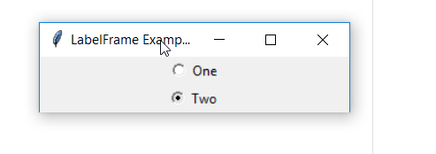
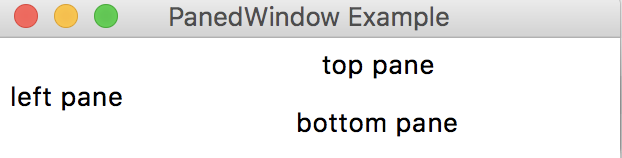

# Tkinter Examples and Screenshots

## Tkinter Button

### Source code example

```python
import tkinter as tk

window = tk.Tk()
window.title("Button Example")
window.geometry("280x50")

btn = tk.Button(window, text="A button", fg="red", bg="yellow")
btn.pack()

window.mainloop()

```

### Screenshot


## Tkinter Menu and Menubutton

## Tkinter Scale

## Tkinter OptionMenu

## Tkinter Dialogs

## Tkinter Checkbutton

## Tkinter LabelFrame and RationButton

### Source code example

```python
import tkinter as tk

window = tk.Tk()
window.title("LabelFrame Example")
window.geometry("280x50")

lf = tk.LabelFrame(window)
lf.pack()

rb1 = tk.Radiobutton(window, text="One", value=1).pack()
rb2 = tk.Radiobutton(window, text="Two", value=2).pack()


window.mainloop()


```

### Screenshot


## Tkinter PanedWindow

```python
from tkinter import *

window = Tk()
window.title("PanedWindow Example")
window.geometry("280x50")

pw1 = PanedWindow()
pw1.pack(fill=BOTH, expand=1)

left = Label(pw1, text="left pane")
pw1.add(left)

pw2 = PanedWindow(pw1, orient=VERTICAL)
pw1.add(pw2)

top = Label(pw2, text="top pane")
pw2.add(top)

bottom = Label(pw2, text="bottom pane")
pw2.add(bottom)

mainloop()
```

### Screenshot


## Tkinter Canvas

# Exercise
 - Create a fork of this repository
 - Clone your fork locally
 - Add a source code example and a screenshot to one of the topics
 - Commit and push your changes to your fork
 - Create a pull request for your changes
