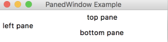

# Tkinter Examples and Screenshots

## Tkinter Button

### Source code example

```python
import tkinter as tk

window = tk.Tk()
window.title("Button Example")
window.geometry("280x50")

btn = tk.Button(window, text="A button", fg="red", bg="yellow")
btn.pack()

window.mainloop()

```

### Screenshot


## Tkinter Menu and Menubutton

### Source code example

```python
import tkinter


top = Tk()

mb=  Menubutton ( top, text="Auswahl", relief=RAISED )
mb.grid()
mb.menu =  Menu ( mb, tearoff = 0 )
mb["menu"] =  mb.menu

m1 = IntVar()
m2 = IntVar()

mb.menu.add_checkbutton ( label="Auswahl 1",
                          variable=m1 )
mb.menu.add_checkbutton ( label="Auswahl 2",
                          variable=m2 )

mb.pack()
top.mainloop()

```

### Screenshot


### Sour

## Tkinter Scale


```python
from tkinter import *

master = Tk()
w = Scale(master, from_=0, to=50)
w.pack()
w = Scale(master, from_=0, to=200, orient=HORIZONTAL)
w.pack()

mainloop()
```

## Tkinter OptionMenu


```python
import tkinter as tk

class View(tk.Tk):
    def __init__(self):
        tk.Tk.__init__(self)
        # Fenster
        self.title("Optionmenu-Demo")
        self.geometry('240x80+400+100')
        # Optionmenu
        L = ['Pizza Diavolo','Pizza Margherita','Pizza quattro stagioni']
        self.vS = tk.StringVar(master=self)
        self.vS.set(L[2])
        self.oS = tk.OptionMenu(self,self.vS,*L, command=self.cbOption)
        self.oS = tk.OptionMenu(self, self.vS, *L, command=self.cbOption)
        self.oS.place(x=20,y=20,width=200)

    def cbOption(self,wert):
        print(wert)

v = View()
v.mainloop()
```

## Tkinter Dialogs

### Sourcecode Example

```python
import tkinter.messagebox as mb

result = mb.askquestion("¯\_(?)_/¯", "I bims 1 Dialog example")
```

### Screenshot


## Tkinter Checkbutton

## Tkinter LabelFrame and RadioButton

### Source code example

```python
import tkinter as tk

window = tk.Tk()
window.title("LabelFrame Example")
window.geometry("280x50")

lf = tk.LabelFrame(window)
lf.pack()

rb1 = tk.Radiobutton(window, text="One", value=1).pack()
rb2 = tk.Radiobutton(window, text="Two", value=2).pack()


window.mainloop()


```

### Screenshot


## Tkinter PanedWindow

```python
from tkinter import *

window = Tk()
window.title("PanedWindow Example")
window.geometry("280x50")

pw1 = PanedWindow()
pw1.pack(fill=BOTH, expand=1)

left = Label(pw1, text="left pane")
pw1.add(left)

pw2 = PanedWindow(pw1, orient=VERTICAL)
pw1.add(pw2)

top = Label(pw2, text="top pane")
pw2.add(top)

bottom = Label(pw2, text="bottom pane")
pw2.add(bottom)

mainloop()
```

### Screenshot


## Tkinter Canvas

```python
from tkinter import *

canvas_width = 200
canvas_height =200
python_pink = "#FD4BC9"

master = Tk()

w = Canvas(master,
           width=canvas_width,
           height=canvas_height)
w.pack()

points = [100, 140, 110, 110, 140, 100, 110, 90, 100, 60, 90, 90, 60, 100, 90, 110]

w.create_polygon(points, outline=python_pink,
            fill='purple', width=3)

mainloop()

```

### Screenshot


# Exercise
 - Create a fork of this repository
 - Clone your fork locally
 - Add a source code example and a screenshot to one of the topics
 - Commit and push your changes to your fork
 - Create a pull request for your changes
